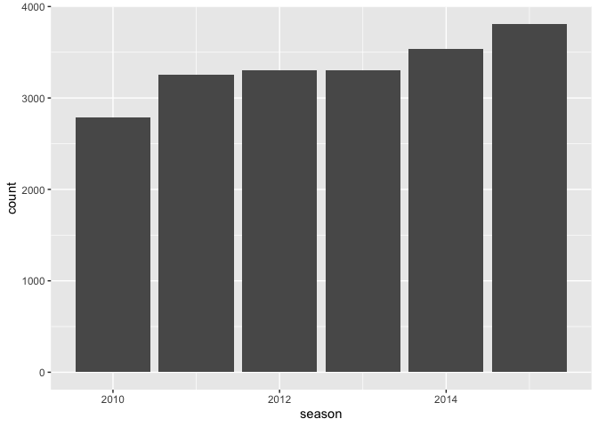
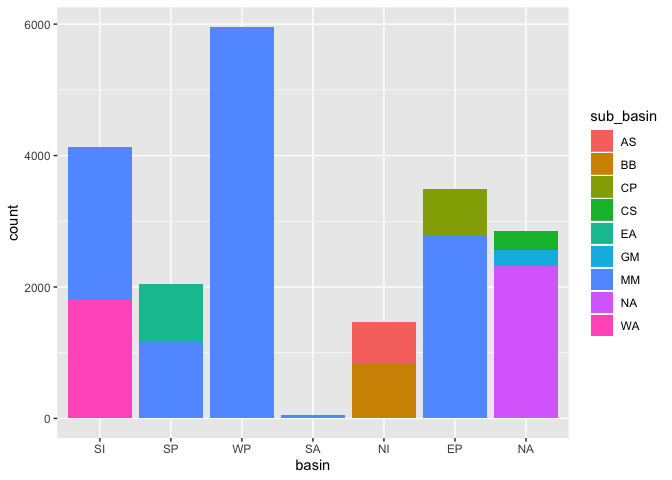
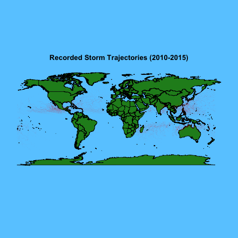

IBTrACS-Report-victoria-tovmasyan.Rmd
================

-----

# An Analysis of IBTrACS Storms Data

## Compiling All Storms Data

In order to efficiently organize and later analyze our data, I used bash
to download individual .csv files of IBTrACS Storms Data from 6
different seasons: 2010, 2011, 2012, 2013, 2014, and 2015. These files
can be found in the workout1 folder labeled
`data`.

``` bash
curl -O "ftp://eclipse.ncdc.noaa.gov/pub/ibtracs/v03r10/all/csv/year/Year.2010.ibtracs_all.v03r10.csv"
curl -O "ftp://eclipse.ncdc.noaa.gov/pub/ibtracs/v03r10/all/csv/year/Year.2011.ibtracs_all.v03r10.csv"
curl -O "ftp://eclipse.ncdc.noaa.gov/pub/ibtracs/v03r10/all/csv/year/Year.2012.ibtracs_all.v03r10.csv"
curl -O "ftp://eclipse.ncdc.noaa.gov/pub/ibtracs/v03r10/all/csv/year/Year.2013.ibtracs_all.v03r10.csv"
curl -O "ftp://eclipse.ncdc.noaa.gov/pub/ibtracs/v03r10/all/csv/year/Year.2014.ibtracs_all.v03r10.csv"
curl -O "ftp://eclipse.ncdc.noaa.gov/pub/ibtracs/v03r10/all/csv/year/Year.2015.ibtracs_all.v03r10.csv"
```

After this, I compiled the first twelve columns (and all rows) of each
season into one central file named `ibtracs-2010-2015.csv`, which can be
found in the workout1 folder labeled `data`. This was done to make the
storms data from all seasons easily accessible from one .csv
file.

``` bash
head -n 2 Year.2010.ibtracs_all.v03r10.csv | tail -n +2 | cut -f 1-12 -d ","  > ibtracs-2010-2015.csv
cut -f 1-12 -d "," Year.2010.ibtracs_all.v03r10.csv | tail -n +4 >> ibtracs-2010-2015.csv  
cut -f 1-12 -d "," Year.2011.ibtracs_all.v03r10.csv | tail -n +4 >> ibtracs-2010-2015.csv
cut -f 1-12 -d "," Year.2012.ibtracs_all.v03r10.csv | tail -n +4 >> ibtracs-2010-2015.csv
cut -f 1-12 -d "," Year.2013.ibtracs_all.v03r10.csv | tail -n +4 >> ibtracs-2010-2015.csv
cut -f 1-12 -d "," Year.2014.ibtracs_all.v03r10.csv | tail -n +4 >> ibtracs-2010-2015.csv
cut -f 1-12 -d "," Year.2015.ibtracs_all.v03r10.csv | tail -n +4 >> ibtracs-2010-2015.csv
```

*This code can be viewed in the workout1 folder `code` in the file named
`make-ibtracs-data-script.txt`.*

## Preliminary Data Analysis and Mapping

Using the newly created `ibtracs-2010-2015.csv`, I began conducting some
preliminary data analysis.

*All of the following files can be found in the `output` folder. The
code can be viewed in the workout1 folder `code` in the file named
`make-ibtracs-data-script.txt`.*

### Records Per Year

Using bash, I created the file `records-per-year.txt` to mark the number
of storm records per season (or per
year).

``` bash
cut -f 2 -d "," ibtracs-2010-2015.csv | tail +2 | sort | uniq -c > ../output/records-per-year.txt
```

    ## 2787 2010
    ## 3255 2011
    ## 3307 2012
    ## 3299 2013
    ## 3537 2014
    ## 3810 2015

From this .txt file, you can gather the following information:

  - 2010 Season: 2787 records
  - 2011 Season: 3255 records
  - 2012 Season: 3307 records
  - 2013 Season: 3299 records
  - 2014 Season: 3537 records
  - 2015 Season: 3810 records

Hmm… This bulleted list is no fun to read. And it does not give us a
good visualization of the data I just collected. Let’s try turning it
into a bar
plot:

``` r
ggplot(dat,aes(x=season))+geom_bar()
```

<!-- -->

That’s more like it\! Now we can very clearly, easliy, and confidently
convey the answers to a few questions:

**Which season had the fewest storm records?** The 2010 season.  
**Which season had the most storm records?** The 2015 season.  
**Is there a pattern of storm records over time?** Yes. Generally, the
number of storm records has increased over time.

### Basin and Sub-Basin Frequencies

Similarly, I used bash to find the frequency of storm records per basin
and
sub-basin.

``` bash
cut -f 4 -d "," ibtracs-2010-2015.csv | tail +2 | sort | uniq -c > ../output/basin-frequencies.txt
cut -f 5 -d "," ibtracs-2010-2015.csv | tail +2 | sort | uniq -c > ../output/sub-basin-frequencies.txt
```

    ## 3493  EP
    ## 2858  NA
    ## 1465  NI
    ##   49  SA
    ## 4132  SI
    ## 2040  SP
    ## 5958  WP

    ##  618  AS
    ##  847  BB
    ##  719  CP
    ##  293  CS
    ##  871  EA
    ##  239  GM
    ## 12269  MM
    ## 2326  NA
    ## 1813  WA

It’s great to have these numbers, but again, it is not easy to truly
understand the data. Let’s make another
visual:

``` r
ggplot(dat,aes(x=basin))+geom_bar(aes(fill=sub_basin))
```

<!-- -->

Once again, it becomes significantly easier to see the numbers. Now
there is a plethora of questions we can answer simply with a glance at
our bar plot:

**Which basin had the most storm records?** Basin WP.  
**Which basin had the least storm records?** Basin SA.  
**In basin NA, which sub-basin has the most storm-records?** Sub-basin
WA.  
**In which basin can you find sub-basin AS?** Basin NI.

## Deep Data Analysis and Mapping

### Global Representation

Something else we can do with the given data in `ibtracs-2010-2015.csv`
is plot each data point on a world map using the given latitude and
longitudes.



Now, we have an incredible visual to show us the location of the
storms\!

With this map, we can see the density of storms in certain areas based
on how close together and how frequently the red data points appear. For
example, there is a large number of recorded storms off the west coast
of Mexico, and off the coast of China. We can also see that the storms
do not cross the equator, as there are no dots there. Data like this can
provide further insight on important meteorological patterns, such as
wind currents and predicting the direction of future storms.

## Summary

From downloading and centralizing data to creating easy-to-read .png
maps, this workout uses IBTrACS Storms Data to show how analyzing data
and graphic visualization go hand in hand to convey information to an
audience.
